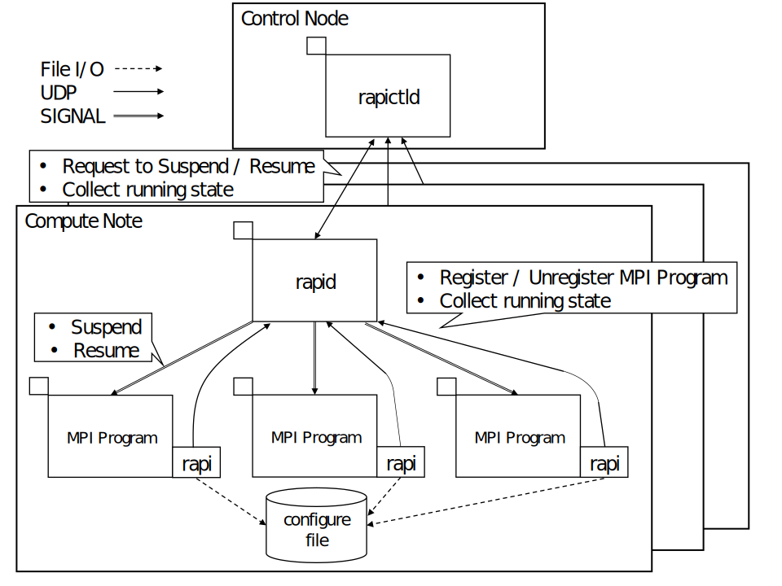

# rapi


## Summary
This system is a Job Scheduler that works **cooperatively** with MPI programs, and consists of below three programs.
* [rapi](./rapi) is a program that works with MPI programs using MPI profiling interface.
* [rapid](./rapid) is a program that manages MPI programs.
* [rapictld](./rapictld) is a program that manages all rapid.

## How cooperative?
1. Rapi sends MPI program information such as "whether is interactive" or "how to stop"
    This allows job scheduler more flexible job management.
2. Rapi sends MPI program's running state such as "Now enter MPI_Send function"
    This allows job scheduler to adjust the timing to suspend/resume jobs.

## Build and Install
1. Clone this repository
    ```bash
    git clone https://github.com/nomlab/rapi.git && cd rapi
    ```
2. Build
    ```bash
    make
    ```
3. Install
    ```bash
    sudo make install # Install rapi.so, rapid, rapictld into /usr/local/bin/
    ```
    ```bash
    make install-local # You can use local install (~/.local/bin/)
    ```
In the above procedure, installation is applied to only one node.
You must do this on all nodes you use.
Or use file sharing, such as NFS.

## Usage
1. Launch rapictld on the control node
    ```bash
    # Interval between suspend and resume is 10ms
    # Compute nodes that locate rapid are "compute_node1" and "compute_node2"
    rapictld 10 compute_node1 cpmpute_node2
    ```
    ```bash
    # You can use debug message
    RUST_LOG=debug rapictld 10 compute_node1 cpmpute_node2
    ```
2. Launch rapid on all compute nodes
    ```bash
    # Launch rapid on each node
    rapid
    ```
    ```bash
    # Launch with ssh
    ssh compute_node1 rapid
    ```
    ```bash
    # You can use debug message
    RUST_LOG=debug rapid
    ```
3. Launch an MPI program with specifying "LD_PRELOAD"
    ```bash
    # -x option is to set environment variable for all MPI processes
    mpirun -x LD_PRELOAD=/usr/local/bin/rapi.so mpi_program
    ```

#### Script
You can use a script for launching rapid, rapictld and MPI program (with rapi).
```bash
script/run.sh -h hostfile -t 100 -p example_program
```
* Launch rapid on all nodes written on hostfile with systemctl
* Launch rapictld on current node with timeslice = "-t" option, node = host in hostfile.
* Launch the specified MPI program with LD_PRELOAD = rapi.so

